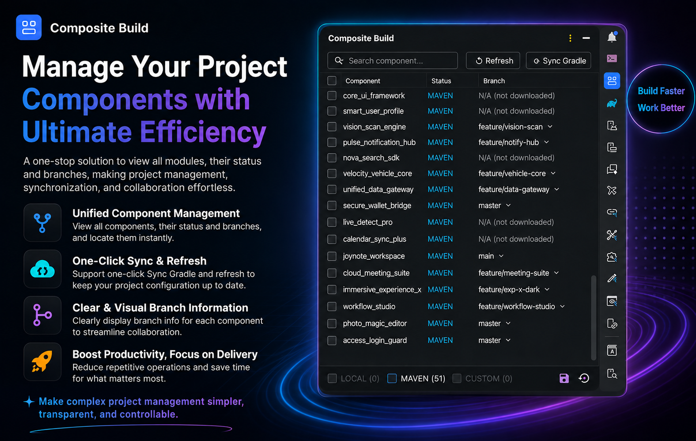

# Composite Build Manager — JetBrains Plugin

English | [中文](README_zh_CN.md)

An Android Studio plugin for managing multi-module Composite Build configuration.

<div align="center"></div>

## Features

| Feature | Description |
|---------|-------------|
| Module status visualization | Displays LOCAL / MAVEN / MISSING status for all submodules |
| One-click toggle | Check/uncheck to switch includeBuild; state is written automatically and takes effect on the next Gradle build |
| Batch operations | Switch all modules to LOCAL or MAVEN with a single click |
| Download missing modules | Click the "↓ Download" button to auto-clone missing submodules |
| Gradle Sync | Trigger Gradle sync after config changes; button highlights when there are unsynced changes |
| Branch management | Shows the current Git branch for each module; supports one-click switching with uncommitted-change checks |
| Search & filter | Filter modules by name |
| Context menu | Right-click in the Project view → Composite Build for quick access |
| Auto-refresh | Refreshes the latest toggle state when the panel is shown or collapsed/expanded |
| Custom components | Manually add local components with dependency substitution rules; paths are persisted |
| Line markers | Shows line markers in build.gradle for dependencies that can use composite build; supports group:artifact resolution from Version Catalog |

## Screenshots

<div align="center"></div>

<div align="center">
  
  &nbsp;&nbsp;
  
</div>

## Build

```bash
cd composite-build-plugin/
./gradlew clean buildPlugin
```

The artifact is located at: `build/distributions/composite-build-plugin-*.zip`

## Installation

1. Android Studio → Settings → Plugins
2. Click the gear icon → Install Plugin from Disk…
3. Select `build/distributions/composite-build-plugin-*.zip`
4. Restart Android Studio

## Usage

1. After opening a project, find the **Composite Build** Tool Window on the right side
2. Go to Settings → Tools → Composite Build Manager and configure the component config file path
3. Check/uncheck module checkboxes to toggle LOCAL / MAVEN mode
4. Click the **⟳ Sync Gradle** button to sync Gradle

## File Overview

| File | Role |
|------|------|
| Component config file (path configured in plugin settings) | Read-only: module registry (name, repo URL, local path, and dependency substitution rules) |
| `~/.gradle/init.d/cbm.gradle` | Gradle init script auto-deployed by the plugin; reads the state file and injects includeBuild config at build time |
| `.idea/cbm/modules.json` | State file written by the plugin in the project's .idea directory; records which modules have composite build enabled; consumed by the init script at build time |
| `.idea/cbm/snapshots.json` | Snapshot file written by the plugin; stores LOCAL module snapshots and branch information per branch for quick recovery when switching branches |

## Config File Format

The file uses [JSON5](https://json5.org/) format, which supports comments and trailing commas.

### Top-level structure

```json5
{
  "repositories": {
    "<moduleName>": { ... },
    ...
  }
}
```

### Module key names

Each key corresponds to an entry in the `[libraries]` section of `gradle/libs.versions.toml` (underscore-separated). The plugin uses this key to map between the Version Catalog and the local directory.

### Module fields

| Field | Type | Required | Description |
|-------|------|----------|-------------|
| `url` | String | Yes | SSH URL of the submodule Git repository; used for `git clone` when downloading |
| `path` | String | No | Absolute path to the local directory; when set, the plugin uses this path instead of the default `../<moduleName>_project` convention |
| `substitutions` | Array | No | Explicit Maven `group:artifact` to full included-build project-path mappings |

### Local directory convention

Submodules are cloned into a directory **sibling** to the main project named `../<moduleName>_project`, for example:

```
workspace/
├── jm_android_project/     ← main project
└── jm_network_project/     ← clone location for jm_network
```

### Example

```json5
{
  "repositories": {
    // Standard module: only a Git URL is needed; local dir defaults to ../<moduleName>_project
    "jm_network": {
      "url": "xxx:xx/jm_network.git",
    },

    // Explicit local path: when path is set, the convention is ignored
    "jm_common": {
      "url": "xxx:xx/jm_common.git",
      "path": "/Users/dev/projects/jm_common",
    },

    // Explicit mapping for nested project paths or differing artifact/project names
    "jm_network": {
      "url": "xxx:xx/network_project.git",
      "substitutions": [
        {
          "module": "com.example:network",
          "project": ":feature:network",
        },
        {
          "module": "com.example:network-api",
          "project": ":feature:network-api",
        },
      ],
    },
  }
}
```

`project` must be the full Gradle project path inside the included build, such as `:feature:network`. When adding a custom component, the plugin first discovers the real project tree through the Gradle Tooling API and falls back to scanning `settings.gradle(.kts)` if the target build cannot currently be configured.

## Compatibility

- Android Studio Hedgehog (2023.3.1) and above
- IntelliJ IDEA 2023.3+

## Changelog

| Version | New Features | Bug Fixes |
|---------|-------------|-----------|
| 1.0.15 | • Detects the Gradle User Home configured for the current Android Studio project<br>• Supports `gradle.user.home`, `GRADLE_USER_HOME`, and the default `~/.gradle` fallback<br>• Automatically redeploys the init script when the IDE Gradle User Home setting changes | • Fixed CBM not taking effect when a custom Gradle User Home caused `cbm.gradle` to be deployed to the wrong directory |
| 1.0.14 | • Added explicit Maven `group:artifact` to full included-build project path mappings<br>• Added support for nested Gradle project paths such as `:feature:network`<br>• Added real project-tree discovery through the Gradle Tooling API with settings-file fallback<br>• Migrated state files to structured substitutions with legacy compatibility | • Removed flavor inference in favor of deterministic explicit substitution rules<br>• Improved JSON escaping, mapping validation, and duplicate-rule handling<br>• Moved Gradle project discovery off the IDE UI thread |
| 1.0.13 | • Added JetBrains IDE MCP server support to expose composite build components as MCP tools<br>• Added English and Chinese promotional images<br>• Updated composite_build icon with dark theme support | • Refactored CBM state file storage to .idea/cbm directory<br>• Fixed MCP jar local reference and reorganized config blocks<br>• Implemented dynamic Android Studio path detection via local.properties<br>• Fixed filter checkbox greying/clickability when MAVEN count is zero |
| 1.0.12 | • Added internationalization support and resource file refactoring<br>• Added project configuration feature and UI refactoring<br>• Config file supports `path` field to specify local path instead of the default convention | — |
| 1.0.11 | — | • Fixed LocalBuildScanner logic for filtering app module<br>• Hide line marker "+" when config file does not exist |
| 1.0.10 | — | Removed IncludeBuildWriter; composite build is now managed entirely by cbm.init.gradle |
| 1.0.9 | • Support resolving group:artifact from Version Catalog (libs.xxx)<br>• Added dependency substitution rules and line markers for custom components | • Fixed false positives when resolving Version Catalog dependencies<br>• Improved error handling and user feedback when adding custom modules<br>• Auto Gradle Sync on custom component deletion only when in LOCAL state<br>• Auto-cancel CUSTOM filter after deleting a custom component |
| 1.0.8 | • Added CUSTOM filter and custom component deletion<br>• Added manual local component addition with persistent path and composite build support | • Fixed filter count not auto-unchecking and greying out when zero<br>• Fixed header select-all checkbox not hidden in CUSTOM mode<br>• Extended module key regex to support hyphens |
| 1.0.7 | • Added save/restore LOCAL module snapshot per branch | • Fixed full branch refresh triggered when checking a module to LOCAL<br>• Branch loading now only happens on init and Refresh button click |
| 1.0.6 | • Branch dialog retains origin/ prefix for remote branches<br>• Branch list shows local branches first, then remote<br>• Auto-create local tracking branch when switching to a remote branch<br>• Show loading animation in branch column while refreshing LOCAL modules | • Fixed branch name disappearing for MAVEN modules during branch refresh |
| 1.0.5 | • Added select-all checkbox in table header<br>• Added LOCAL / MAVEN mutually exclusive filter at the bottom with status count | • Fixed Sync Gradle button false-red after restart<br>• Fixed config/usage being parsed as a module after the repositories block ends<br>• Fixed Refresh button not reloading config file |
| 1.0.4 | • Allow MAVEN modules to switch branches<br>• Show loading animation in checkbox position while downloading | • Fixed status still showing LOCAL after local directory is deleted<br>• Fixed branch list showing only one branch |
| 1.0.3 | • Show actual local Git branch<br>• Support branch switching with uncommitted-change check<br>• Adaptive branch column width with async caching<br>• Sync button highlights when there are pending changes | • Fixed deprecated API warnings<br>• Fixed branch column minimum width too small<br>• Changed default tool window width to 300 |
| 1.0.2 | • Added tool window icon<br>• Auto-refresh toggle state when panel is shown<br>• Show pending Sync reminder after config changes | • Fixed pending Sync hint not disappearing after unchecking<br>• Fixed unable to refresh state when tool window is collapsed/expanded<br>• Removed plugin version upper limit for broader IDE compatibility |
| 1.0.1 | • Changed to manual Gradle Sync trigger | • Fixed status column icon overflowing into checkbox column |
| 1.0.0 | • Initial release: visualize LOCAL / MAVEN / MISSING status<br>• Toggle includeBuild and auto-write config<br>• One-click Gradle Sync<br>• Download missing modules | — |
